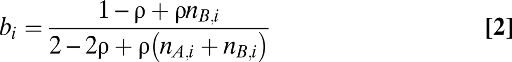

# Allele-specific copy number analysis of tumors

[https://www.pnas.org/doi/full/10.1073/pnas.1009843107]

## Abstract

### **Biological setup:** 

 

### **Computational setup:** 

Based on SNP array technology - 
Ilumina SNP arrays deliver two output tracks: Log R, a measure of total signal intensity, and B allele frequency (BAF), a measure of allelic contrast

Confounding factors: infiltration of nonaberrant cells and aneuploidy of tumor cells

The values for logR and BAF can be modeled by these equations.

$\gamma$ is defined by the platform, while $\rho$ (aberrant cell fraction) and $\phi_t$ are estimated. $i$ is the genomic position.

### **Results:** 

### **Most relevant parts for me**

1. 

### **Figure comments**

&rarr; **Figure 1**